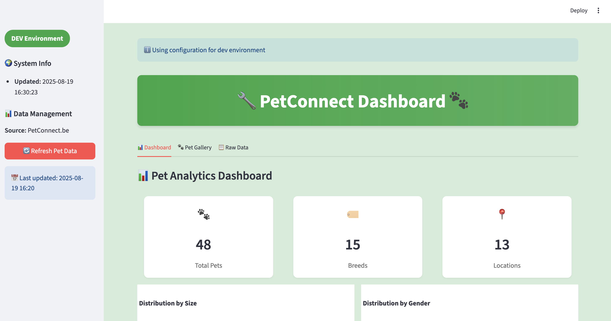
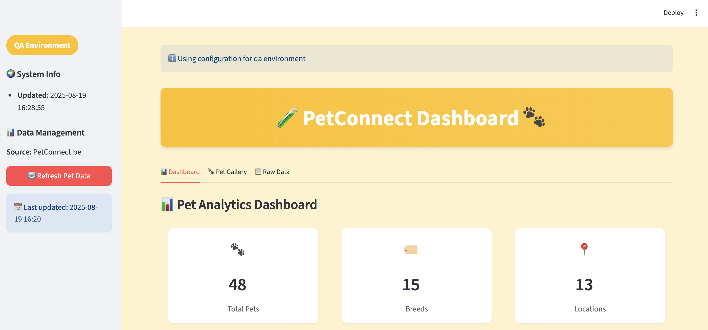
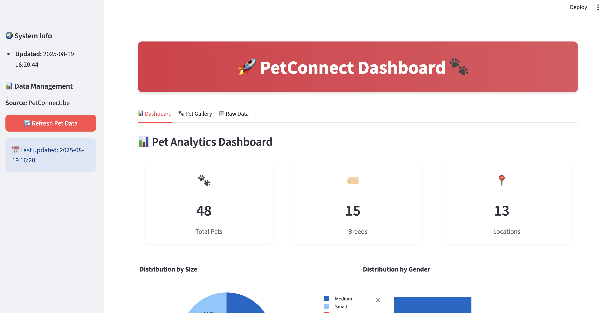
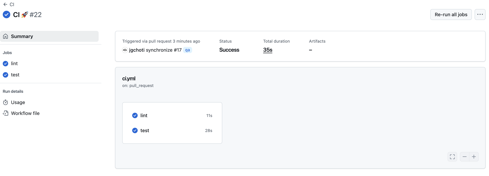
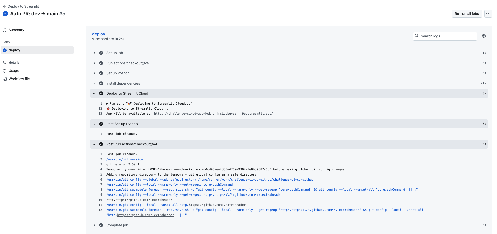
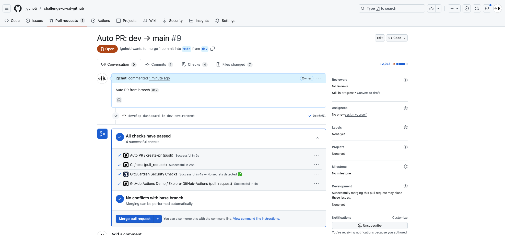

# 🐾 PetConnect CI/CD Dashboard
[](https://github.com/jgchoti/challenge-ci-cd-github/actions/workflows/ci-git.yml)
[](https://github.com/jgchoti/challenge-ci-cd-github/actions/workflows/cd.yml)
[](https://www.python.org/downloads/)


A **real-time pet adoption dashboard** that scrapes data from PetConnect.be, showcasing a complete **DevOps CI/CD pipeline** with automated testing and multi-environment deployments

## 🎯 Project Overview

This project demonstrates DevOps practices by combining:

- **🔬 Data Engineering**: Web scraping with authentication bypass for Wix-based APIs
- **📊 Data Visualization**: Interactive Streamlit dashboard with environment-specific theming
- **🔄 CI/CD Pipeline**: Automated testing and multi-environment deployments

### 🌟 Key Features

- **Real-time Pet Data Scraping**: Bypasses Wix authentication to extract pet adoption data
- **Multi-Environment Architecture**: Dev (green) → QA (yellow) → Production (white/red) with visual themes
- **Automated CI/CD Pipeline**: automated checks including pytest, security scanning, and deployment
- **Interactive Dashboard**: Filter, search, and browse adoptable pets with images

## 🎯 Learning Outcomes

This project demonstrates mastery of:

### Data Engineering

- **GitFlow Workflow**: Feature branches, environment promotion, GitHub Actions
- **Web Scraping**: Complex authentication and rate limiting
- **Data Transformation**: CSV to pandas DataFrame conversion
- **Image Processing**: URL conversion

---

## 🔄 CI/CD Pipeline Flow


### Continuous Integration (CI)

**Triggers:** Auto-created pull requests from any branch push

```yaml
# CI runs on PR events (open, reopen, synchronize)
on:
  pull_request:
    types: [opened, reopened, synchronize]
    branches: [ main ]

Jobs:
├── 🧹 Code Linting (flake8)
└──🧪 Python Testing
```

### Continuous Deployment (CD)

**Triggers:** Merge to main branch (after PR approval)

```yaml
# CD runs only on direct pushes to main
on:
push:
branches: [ main ]
Jobs:
├── 🚀 Deploy to Production
└── 📊 Deployment Summary

```

## 🧪 Testing Strategy

Comprehensive test uses **pytest** with mocking for reliable CI/CD:

```python
# Example from our test suite
import pytest
import pandas as pd
from streamlit_app import load_pet_data
from app.scraper import Scraper

class TestScraperUnit:
    def test_scraper_initialization(self):
        """Test scraper initializes correctly"""
        scraper = Scraper()
        assert scraper.base_url == "https://www.petconnect.be"
        assert scraper.auth_token is not None
```

### Test Coverage

- **Unit Tests**: Core scraper functionality and data processing
- **Integration Tests**: API authentication and data flow

## 📂 Project Structure

```
challenge-ci-cd-github/
├── app/
│   ├── __init__.py
│   ├── main.py                 # main entry for terminal
│   └── scraper.py              # PetConnect.be API scraper
├── tests/
│   ├── __init__.py
│   └── test_app.py             # pytest test suite
├── .github/workflows/
│   ├── ci.yml                  # Continuous Integration
│   └── cd.yml                  # Continuous Deployment
├── .streamlit/
│   └── config.toml             # Environment configurations
├── screenshots/                # Pipeline & dashboard screenshots
├── requirements.txt            # Python dependencies
├── streamlit_app.py            # Streamlit dashboard
└── README.md                   # This documentation
```

## 🚀 Quick Start

### Prerequisites

- Python 3.9+
- Git
- GitHub account with Actions enabled

### Local Development

```bash
# Clone the repository
git clone https://github.com/jgchoti/challenge-ci-cd-github.git
cd challenge-ci-cd-github

# Create virtual environment
python -m venv venv
source venv/bin/activate  # On Windows: venv\Scripts\activate

# Install dependencies
pip install -r requirements.txt

# Run the application
export ENVIRONMENT=dev
streamlit run streamlit_app.py
```

## 📊 Dashboard Features

### Interactive Elements

- **🔍 Search & Filter**: By name, breed, size, gender
- **📷 Image Gallery**: Converted Wix images with fallbacks
- **📄 Data Export**: CSV download with timestamps
- **🔗 Deep Links**: Direct links to adoption pages

## 📸 Screenshots

### Development Environment


_Green-themed development environment with debug information_

### QA Environment


_Yellow-themed QA environment for testing validation_

### Production Environment


_white/Red-themed production environment with live data_

### CI/CD Pipeline


_GitHub Actions CI pipeline with all checks passing_


_Deployment workflow_

### Manual Approval Gate


_Automated PR creation for pushes to any branch except main_

## 🙏 Acknowledgments

- **[PetConnect.be](https://www.petconnect.be)** - Pet adoption data source
- **[Streamlit](https://streamlit.io/)** - Interactive web framework
- **[GitHub Actions](https://github.com/features/actions)** - CI/CD automation
- **[pytest](https://pytest.org/)** - Testing framework
- **[BeCode](https://becode.org/)** - Data/Ai training

---

[](https://github.com/jgchoti/challenge-ci-cd-github/actions)
[](https://pet-adoption-be.streamlit.app/)
